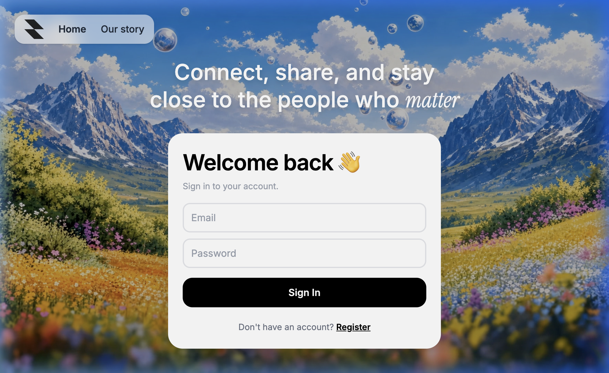
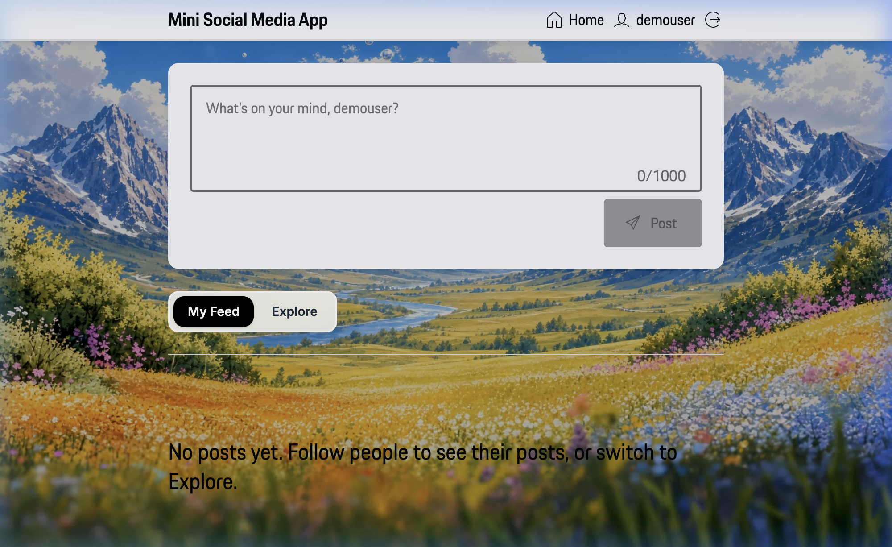
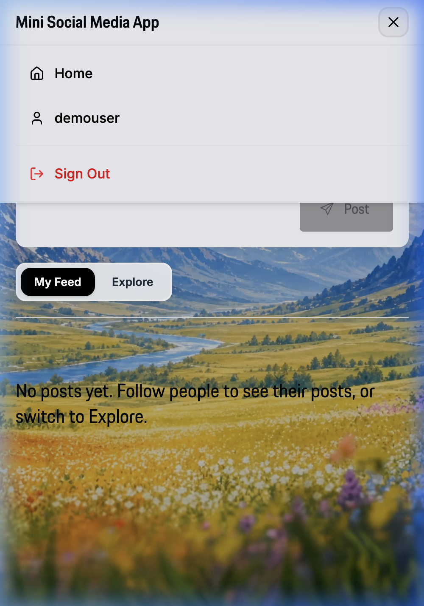

# Mini Social Media App

> 🔗 **Live Demo**: You can access the live application here: [mini-social-media-app-faub.onrender.com](https://mini-social-media-app-faub.onrender.com/) [](https://mini-social-media-app-faub.onrender.com/)

A minimal, elegant, and distraction-free social sanctuary designed for genuine communication. The application features a clean, responsive layout built with the **Porsche Design System** and **Tailwind CSS v4**, supported by a robust Express backend. The entire application is containerized using a multi-stage **Docker** build for seamless mono-service deployment on **Render**.

## 📱 Walkthrough Demo

Below is an animation demonstrating the user journey: registering a new user, accessing the feed, opening the mobile-responsive burger menu, editing user profiles, posting, liking, and logging out:


---

## 📸 Screenshots

### Desktop Views

**Landing Page / Authentication**


**Feed / Timeline**


### Mobile View

**Responsive Navigation (Mobile Burger Menu)**


---

## ✨ Features

- **User Profiles**: Secure registration, login, and token-based authentication (JWT). Users can customize their biographies and track follower/following counts.
- **Feed & Explore**: Toggle between your personal timeline ("My Feed" containing posts from followed users) and the global feed ("Explore" containing posts from everyone).
- **Posts & Comments**: Create and delete posts, like posts, and engage in threaded conversations with a real-time comment section.
- **Like & Follow System**: Toggling likes and following/unfollowing profiles with immediate UI feedback.
- **Mobile-Responsive Design**: Equipped with a premium hamburger menu dropdown for seamless mobile navigation without layout cluttering.
- **Cinematic Background**: Features a premium, immersive looping video background that elevates the visual aesthetics of the platform.

---

## 🛠️ Technology Stack

### Frontend
- **Core**: React 19, TypeScript, Vite
- **Styling**: Tailwind CSS v4, Vanilla CSS
- **Components**: Porsche Design System (Components React), Lucide React Icons

### Backend
- **Core**: Node.js, Express.js
- **Security**: JWT (jsonwebtoken), bcryptjs (password hashing), CORS

### Database (Hybrid Model)
- **Development**: Local **SQLite** database (`database.sqlite`) for zero-configuration, offline development.
- **Production**: Cloud **PostgreSQL** database (via `pg` Connection Pool with SSL support) for scalable, secure deployments.

---

## 🚀 Getting Started

### 📋 Prerequisites

- **Node.js**: v18 or higher
- **npm**: v9 or higher

### 1. Installation

Clone the repository and install dependencies for both the frontend (root directory) and the backend (`server` directory):

```bash
# Install frontend dependencies
npm install

# Install backend dependencies
npm --prefix server install
```

### 2. Environment Configuration

Create a `.env` file in the `server` directory:

```bash
# server/.env
PORT=5001
JWT_SECRET=your-random-jwt-secret-key
# DATABASE_URL=postgresql://... (Optional: Only if you want to connect to PostgreSQL locally)
```

> [!NOTE]
> If `DATABASE_URL` is omitted from `server/.env`, the server will automatically default to local SQLite mode, saving data in `server/database.sqlite`.

### 3. Running Locally

Start the backend and frontend dev servers concurrently:

```bash
# Start the Express server (runs on http://localhost:5001)
npm run server

# Start the Vite development server (runs on http://localhost:5173)
npm run dev
```

---

## ☁️ Deployment Guidelines (Render)

### 1. PostgreSQL Database
1. Go to **Render** and create a new **PostgreSQL Database** (Free tier).
2. Copy the **Internal Database URL** for production use.
3. (Optional) Copy the **External Database URL** and place it in your local `server/.env` if you wish to connect your local environment to the cloud database.

### 2. Express Backend (Web Service)
1. Create a new **Web Service** on Render and connect it to your GitHub repository.
2. In the service settings, configure the following Environment Variables:
   - `DATABASE_URL` = `<your-internal-database-url>`
   - `JWT_SECRET` = `<your-production-jwt-secret>`
   - `PORT` = `5001`
   - `NODE_ENV` = `production`
3. Configure the build and start commands:
   - **Build Command**: `npm --prefix server install && npm --prefix server run build`
   - **Start Command**: `npm --prefix server start`

### 3. React Frontend (Static / Vercel / Netlify)
1. Connect your repository to **Vercel** or **Render Static Sites**.
2. Configure your API base URL to point to your deployed backend URL.
3. Build and deploy static assets.
